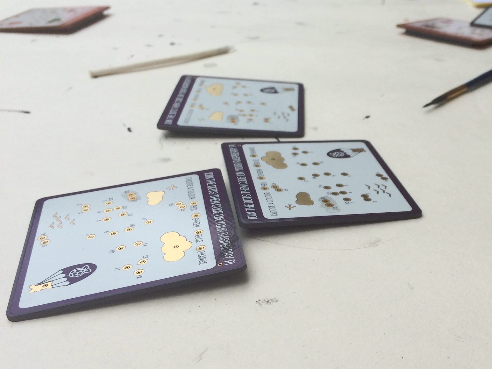
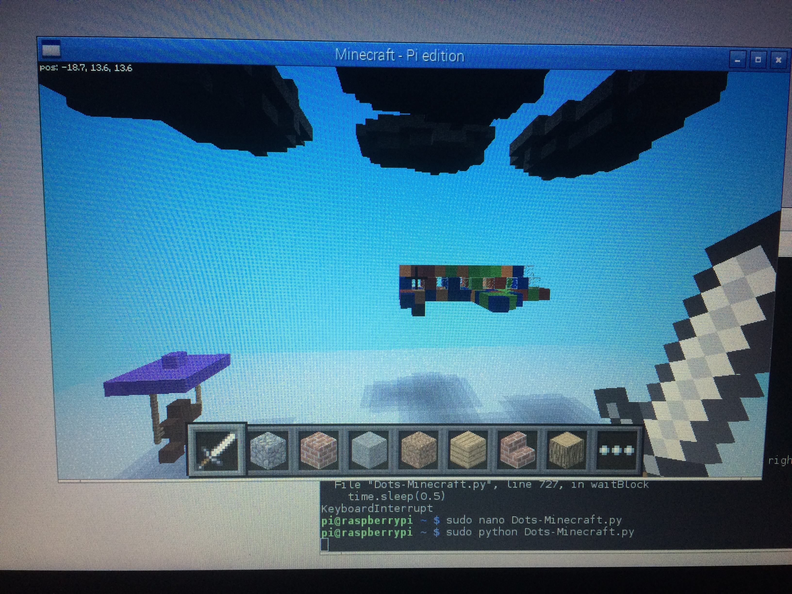

Raspberry Pi Dots Board Minecraft Simulation
====



A Python (2.7) based script for use with the Raspberry Pi Foundation Dots Boards and Minecraft Pi.   
The program reads the status of the dots and generates an airplane inside Minecraft Pi based on the dots painted. This plane then attempts to fly in the game.   



## Installation
1. Clone the github repository - ```git clone https://github.com/gbaman/dots-minecraft.git``` 
2. Change navigate to the folder - ```cd dots-minecraft```      
3. Run the program with ```sudo python Dots-Minecraft.py```

## License
The project is licensed under the MIT license. See the LICENSE file for a full copy of the license.
